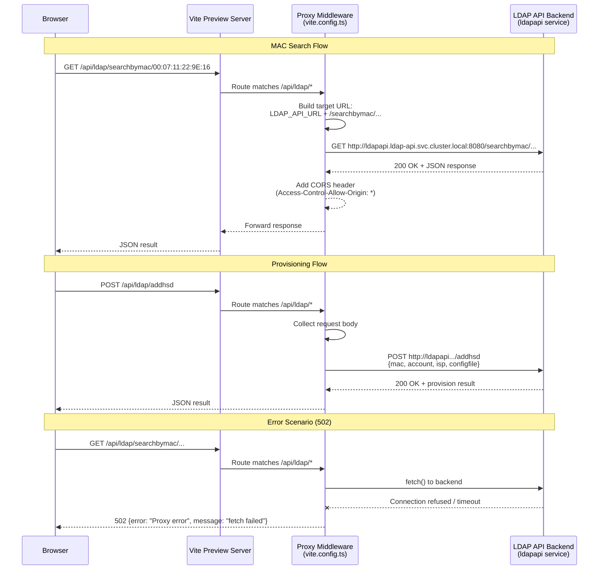

# VIAVI Meter Provisioning

A web application for field technicians to validate and provision VIAVI network meters. Technicians enter a MAC address, the app verifies it belongs to a known VIAVI device, checks its current status in the provisioning system, and registers it for network access.

## What It Does

1. **MAC Validation** — Accepts a MAC address and verifies the OUI (first 6 hex digits) matches an approved VIAVI manufacturer prefix.
2. **Status Check** — Queries the LDAP API to determine if the device is already provisioned.
3. **Provisioning** — Registers new devices with the backend, assigning account, ISP, and config-file parameters.

## Architecture



### Key Components

| Layer | Technology | Purpose |
|-------|------------|---------|
| Frontend | Vite + React + TypeScript | Single-page UI with step-by-step workflow |
| UI Kit | shadcn/ui + Tailwind CSS | Consistent, accessible components |
| State | @tanstack/react-query | Server-state caching and mutations |
| Proxy | Vite preview middleware | CORS bypass for LDAP API calls |
| Backend | LDAP API (external) | MAC search and provisioning endpoints |

### API Proxy

The app runs in **Vite preview mode** in production. A custom middleware in `vite.config.ts` proxies `/api/ldap/*` requests to the backend, adding CORS headers so the browser accepts cross-origin responses.

| Environment Variable | Purpose |
|---------------------|---------|
| `LDAP_API_URL` | Backend URL (defaults to external; set to internal service URL in OpenShift) |

---

## Getting Started

```sh
npm install          # Install dependencies
npm run dev          # Start development server (port 8080)
npm run build        # Production build
npm run preview      # Preview production build locally
```

## Testing

```sh
npm run test              # Vitest watch mode
npm run test -- --run     # Single run (CI)
npm run test src/e2e      # E2E tests only
npm run lint              # ESLint
```

## Directory Structure

```
src/
├── components/       # UI components (MacValidator, ProvisioningPage, etc.)
├── pages/            # Route components (Index, NotFound)
├── services/         # API clients (provisioningApi)
├── utils/            # Helpers (macUtils, errorUtils)
├── hooks/            # Custom React hooks
├── e2e/              # End-to-end tests
└── test/             # Test setup

public/config/
├── approved-ouis.json      # Allowed VIAVI OUI prefixes
└── provision-defaults.json # Default account/ISP/config values

openshift/            # Deployment manifests
```

## Environment Variables

| Variable | Description | Default |
|----------|-------------|---------|
| `VITE_API_BASE_URL` | Base URL for provisioning API | `https://ldap-api.apps.prod-ocp4.corp.cableone.net/` |
| `VITE_USE_STUB_API` | Use stubbed responses (dev only) | `true` in dev, `false` in prod |
| `LDAP_API_URL` | Backend URL for proxy (runtime) | External URL; override in OpenShift ConfigMap |

---

## Deployment

### Lovable (quick)

Open [Lovable](https://lovable.dev/projects/356018a8-3148-4068-995a-374260576ddf) → Share → Publish.

### OpenShift (production)

See the [OpenShift deployment guide](docs/openshift-deployment.md) for:
- Tekton pipeline setup
- ConfigMap and Secret configuration
- Route and NetworkPolicy manifests
- Environment variable injection

---

## Custom Domain

Navigate to **Project → Settings → Domains** in Lovable to connect a custom domain.
